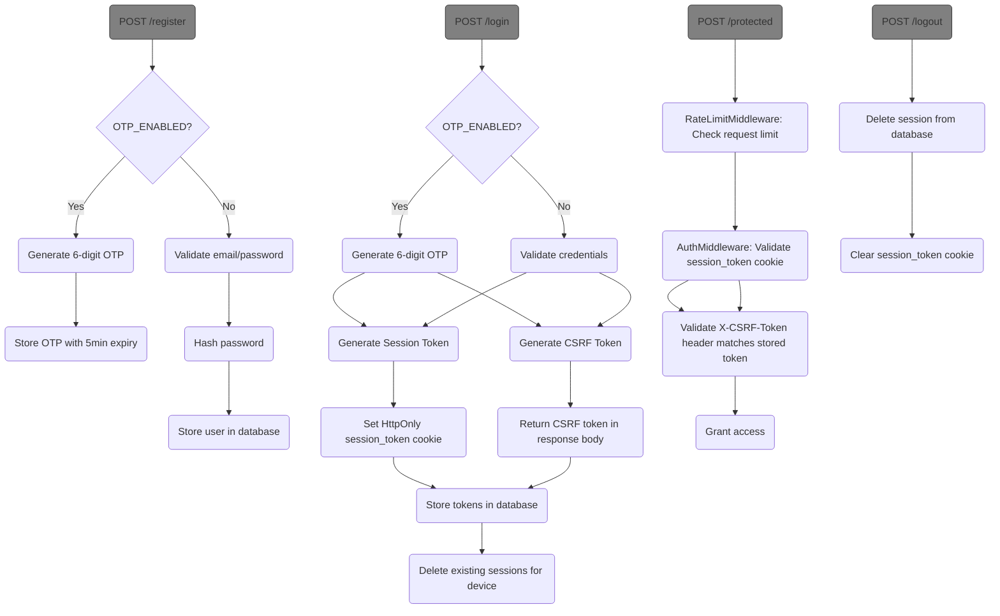

# Authentication Workflow

## Authentication Flows


## Key Feature Components

### Common Components

1. **Session Token**:
   - Stored in HttpOnly cookie
   - Validated against database-stored token
   - Required for all authenticated requests
   - Supports multiple concurrent sessions across devices

2. **CSRF Protection**:
   - Session-bound CSRF token stored in database (stateful)
   - Must be sent in X-CSRF-Token header
   - Validated against database-stored token
   - Protects against CSRF attacks

3. **Password Security**:
   - Hashed using bcrypt
   - Minimum 6 characters enforced
   - Never stored in plaintext

### OTP-Specific Components

4. **OTP Generation**:
   - 6-digit numeric codes
   - 5 minute expiration period
   - Stored securely in database
   - Automatically cleared after use or expiration

5. **OTP Verification**:
   - Requires valid session token from cookie
   - Compares against stored OTP
   - Enforces expiration check
   - Clears OTP after successful verification

### Common Components

6. **Auth Middleware**:
   - Centralized authentication check
   - Validates session and CSRF tokens
   - Adds user ID to request context

5. **Dynamic Routing**:
   - Handler registry allows adding routes dynamically
   - Middleware applied consistently

## Testing Authentication

### Email and Password based Authentication
Registration:
```
curl http://localhost:8080/register \ 
             -d "username=myuser" -d "password=password123"
```
or for more verbose information add `-v`.

Login:
```
curl http://localhost:8080/login \
             -d "username=myuser" -d "password=password123" -c cookies.txt
```

Accessing protected endpoint with CSRF token:
```
# First login to get CSRF token
curl -X POST http://localhost:8080/login \
     -d "email=user@example.com" -d "password=password123" \
     -c cookies.txt -o response.json

# Extract CSRF token from response
CSRF_TOKEN=$(jq -r '.csrf_token' response.json)

# Access protected endpoint
curl -X POST http://localhost:8080/dashboard \
     -H "X-CSRF-Token:$CSRF_TOKEN" \
     -b cookies.txt
```

Logout:
```
curl -X POST http://localhost:8080/logout \
           -H "X-CSRF-Token:<CSRFToken>" \
           -d "username=myuser" \
           -b cookies.txt
```

Note, `curl` automatically uses POST method when sending data (-d flag). The -X POST flag is redundant in this case but doesn't affect functionality.

### Email and OTP based Authentication

When OTP_ENABLED=true, authentication uses one-time passwords instead of traditional passwords:

1. **Registration**:
   - Creates user record with email only
   - Generates initial OTP
   - Returns OTP code in response

2. **Login**:
   - Generates new OTP if none provided
   - Verifies OTP if provided
   - Creates session on successful verification

3. **OTP Verification**:
   - Required before accessing protected routes
   - Validates OTP against stored value
   - Enforces 5-minute expiration

Example flows:

**Registration**:
```
curl http://localhost:8080/register \
     -d "email=myuser@example.com" \
     -c "cookies.txt"
# Response includes OTP code
```

**Login (first step - get OTP)**:
```
curl http://localhost:8080/login \
     -d "email=myuser@example.com" \
     -c "cookies.txt"
# Response includes new OTP code
```

**OTP Verification**:
```
curl http://localhost:8080/verify-otp \
     -d "email=myuser@example.com" \
     -d "otp_code=123456" \
     -b "cookies.txt"
# On success, returns auth token
```

**Protected Access**:
```
curl http://localhost:8080/protected \
     -H "X-CSRF-Token:..." \
     -b "cookies.txt"
```

**Logout**:
```
curl http://localhost:8080/logout \
     -d "email=myuser@example.com" \
     -b "cookies.txt"
# Clears session and OTP data