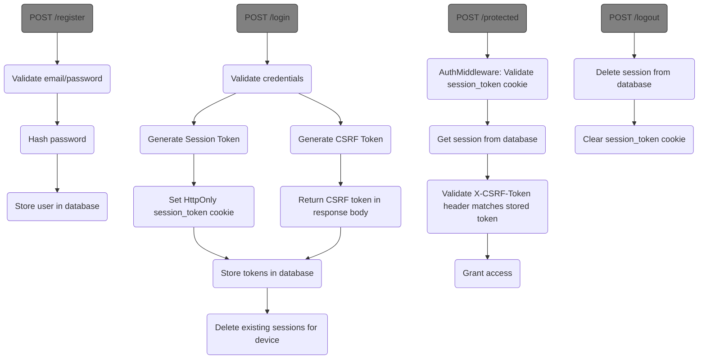

# Authentication Workflow



## Key Feature Components

1. **Session Token**:
   - Stored in HttpOnly cookie
   - Validated against database-stored token
   - Required for all authenticated requests
   - Supports multiple concurrent sessions across devices

2. **CSRF Protection**:
   - Session-bound CSRF token stored in database (stateful)
   - Must be sent in X-CSRF-Token header
   - Validated against database-stored token
   - Protects against CSRF attacks

3. **Password Security**:
   - Hashed using bcrypt
   - Minimum 6 characters enforced
   - Never stored in plaintext

4. **Auth Middleware**:
   - Centralized authentication check
   - Validates session and CSRF tokens
   - Adds user ID to request context

5. **Dynamic Routing**:
   - Handler registry allows adding routes dynamically
   - Middleware applied consistently

## Testing Authentication

Registration:
```
curl -X POST http://localhost:8080/register \ 
             -d "username=myuser" -d "password=password123"
```
or for more verbose information
```
curl -X POST -F "username=myuser" -F "password=password123" -v http://localhost:8080/register
```

Login:
```
curl -X POST http://localhost:8080/login \
             -d "username=myuser" -d "password=password123" -c cookies.txt
```

Accessing protected endpoint with CSRF token:
```
# First login to get CSRF token
curl -X POST http://localhost:8080/login \
     -d "email=user@example.com" -d "password=password123" \
     -c cookies.txt -o response.json

# Extract CSRF token from response
CSRF_TOKEN=$(jq -r '.csrf_token' response.json)

# Access protected endpoint
curl -X POST http://localhost:8080/dashboard \
     -H "X-CSRF-Token:$CSRF_TOKEN" \
     -b cookies.txt
```

Logout:
```
curl -X POST http://localhost:8080/logout \
           -H "X-CSRF-Token:<CSRFToken>" \
           -d "username=myuser" \
           -b cookies.txt
```