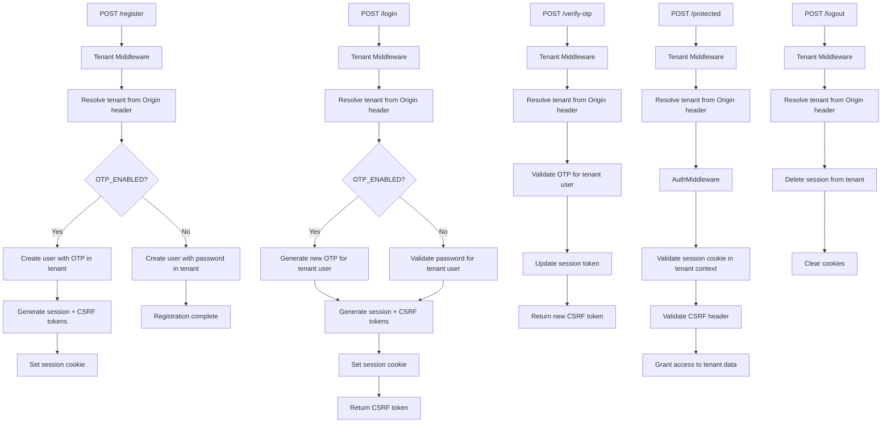

# Authentication Workflow

## Overview

This application supports two authentication modes with multi-tenant isolation:
- **Password-based authentication** (OTP_ENABLED=false)
- **OTP-based authentication** (OTP_ENABLED=true)

Both modes use session tokens with CSRF protection for secure API access.

## Multi-Tenant Architecture

All authentication operations are tenant-scoped:
- **Domain Resolution**: Each tenant is identified by their domain via the `Origin` header
- **Data Isolation**: Users, sessions, and all data are completely isolated per tenant

## Authentication Flows



## Authentication Components

### 1. Session Management
- **Session Token**: Stored in HttpOnly cookie, validated within tenant context
- **CSRF Token**: Returned in response body, sent in `X-CSRF-Token` header
- **Session Storage**: Database-backed with 24-hour expiration, scoped to tenant
- **Tenant Isolation**: All sessions are isolated per tenant

### 2. Password Authentication (OTP_ENABLED=false)
- **Registration**: Creates user with hashed password within tenant
- **Login**: Validates credentials and creates session for tenant user
- **Tenant Scoping**: Same email can exist in different tenants

### 3. OTP Authentication (OTP_ENABLED=true)
- **Registration**: Creates user and generates initial OTP within tenant
- **Login**: Generates new OTP for existing tenant users
- **Verification**: 6-digit OTP with 5-minute expiration

### 4. Security Features
- **CSRF Protection**: Required for all protected endpoints
- **Session Validation**: Automatic expiry and cleanup
- **Tenant Isolation**: Complete data separation between tenants

## API Endpoints

### Registration

**Password Mode:**
```bash
curl -X POST http://localhost:8080/register \
     -H "Origin: example.com" \
     -d "email=user@example.com" \
     -d "password=mypassword123"
```

**OTP Mode:**
```bash
curl -X POST http://localhost:8080/register \
     -H "Origin: example.com" \
     -d "email=user@example.com" \
     -c cookies.txt
# Response: "Setting cookie with session token: xxx, CSRF: yyy. OTP: 123456"
```

### Login

**Password Mode:**
```bash
curl -X POST http://localhost:8080/login \
     -H "Origin: example.com" \
     -d "email=user@example.com" \
     -d "password=mypassword123" \
     -c cookies.txt
# Response: "User with email user@example.com logged in successfully!
#           sessionToken: xxx, CSRF: yyy."
```

**OTP Mode:**
```bash
curl -X POST http://localhost:8080/login \
     -H "Origin: example.com" \
     -d "email=user@example.com" \
     -c cookies.txt
# Response: "User with email user@example.com logged in successfully!
#           sessionToken: xxx, CSRF: yyy. OTP code: 123456"
```

### OTP Verification (OTP Mode Only)

```bash
curl -X POST http://localhost:8080/verify-otp \
     -H "Origin: example.com" \
     -d "otp_code=123456" \
     -H "X-CSRF-Token: YOUR_CSRF_TOKEN" \
     -b cookies.txt
# Response: "OTP verified successfully, new session token set in cookie. CSRF: yyy"
```

### Accessing Protected Resources

```bash
# Extract CSRF token from login response
CSRF_TOKEN="your_csrf_token_from_login_response"

# Access protected endpoint
curl -X POST http://localhost:8080/dashboard \
     -H "Origin: example.com" \
     -H "X-CSRF-Token: $CSRF_TOKEN" \
     -b cookies.txt
# Response: "Dashboard accessed successfully. Found session_token: xxx"
```

### Logout

```bash
curl -X POST http://localhost:8080/logout \
     -H "Origin: example.com" \
     -H "X-CSRF-Token: YOUR_CSRF_TOKEN" \
     -c cookies.txt
```

Note, `curl` automatically uses POST method when sending data (-d flag). The -X POST flag is redundant in this case but doesn't affect functionality.

## Response Formats

### Successful Registration/Login
- **Session Cookie**: `session_token` (HttpOnly, Secure in production)
- **Response Body**: Contains CSRF token for API calls
- **OTP Mode**: Also includes OTP code in response

### Error Responses
- **400 Bad Request**: Invalid input (malformed email, short password)
- **401 Unauthorized**: Invalid credentials or expired session
- **409 Conflict**: Email already exists (registration)
- **500 Internal Server Error**: Server-side errors

## Security Considerations

### Session Security
- HttpOnly cookies prevent XSS access
- Secure flag enabled in production
- 24-hour expiration with automatic cleanup
- Complete tenant data isolation

### CSRF Protection
- Stateful CSRF tokens stored in database
- Required for all state-changing operations
- Validated against session-bound tokens

### Password Security
- bcrypt hashing with salt
- Minimum length validation
- No plaintext storage

### OTP Security
- Time-based expiration (5 minutes)
- Single-use tokens
- Automatic cleanup after verification

## Development Notes

### Environment Configuration
```bash
# Password mode
OTP_ENABLED=false

# OTP mode
OTP_ENABLED=true
```

### Testing
- Integration tests cover both authentication modes
- CSRF token handling automated in test helpers
- Database cleanup between test runs
- Docker-based test environment with migrations

### Database Schema
- `tenants` table: id, name, domain, api_key, settings, is_active
- `users` table: id, tenant_id, email, password_hash, otp_code, otp_expires_at
- `sessions` table: id, tenant_id, user_id, session_token, csrf_token, user_agent, ip, expires_at
- All tables include tenant_id for complete data isolation

### Tenant Management
- **Configuration**: YAML-based with auto-sync on startup
- **Domain Resolution**: Tenant identified via Origin header
- **Data Isolation**: All queries scoped to tenant context
