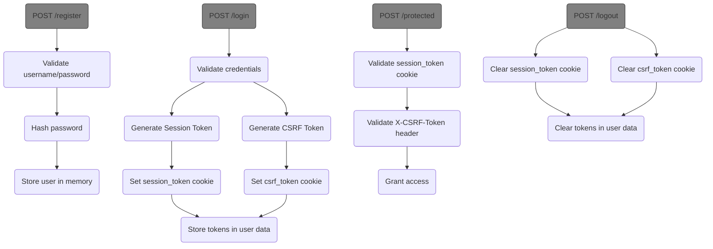

# Authentication Workflow



## Key Components

1. **Session Token**:
   - Stored in HttpOnly cookie
   - Validated against server-side stored token
   - Required for all authenticated requests

2. **CSRF Token**:
   - Stored in regular cookie
   - Must be sent in X-CSRF-Token header
   - Validated against server-side stored token
   - Protects against CSRF attacks

3. **Password Security**:
   - Hashed using bcrypt
   - Minimum 6 characters enforced
   - Never stored in plaintext

## Testing Authentication

Registration:
```
curl -X POST http://localhost:8080/register \ 
             -d "username=myuser" -d "password=password123"
```
or for more verbose information
```
curl -X POST -F "username=myuser" -F "password=password123" -v http://localhost:8080/register
```

Login:
```
curl -X POST http://localhost:8080/login \
             -d "username=myuser" -d "password=password123" -c cookies.txt
```

Accesing protected endpoint with CSRF token:
```
curl -X POST http://localhost:8080/protected \
           -H "X-CSRF-Token:<CSRFToken>" \
           -d "username=myuser" \
           -b cookies.txt
```

Logout:
```
curl -X POST http://localhost:8080/logout \
           -H "X-CSRF-Token:<CSRFToken>" \
           -d "username=myuser" \
           -b cookies.txt
```