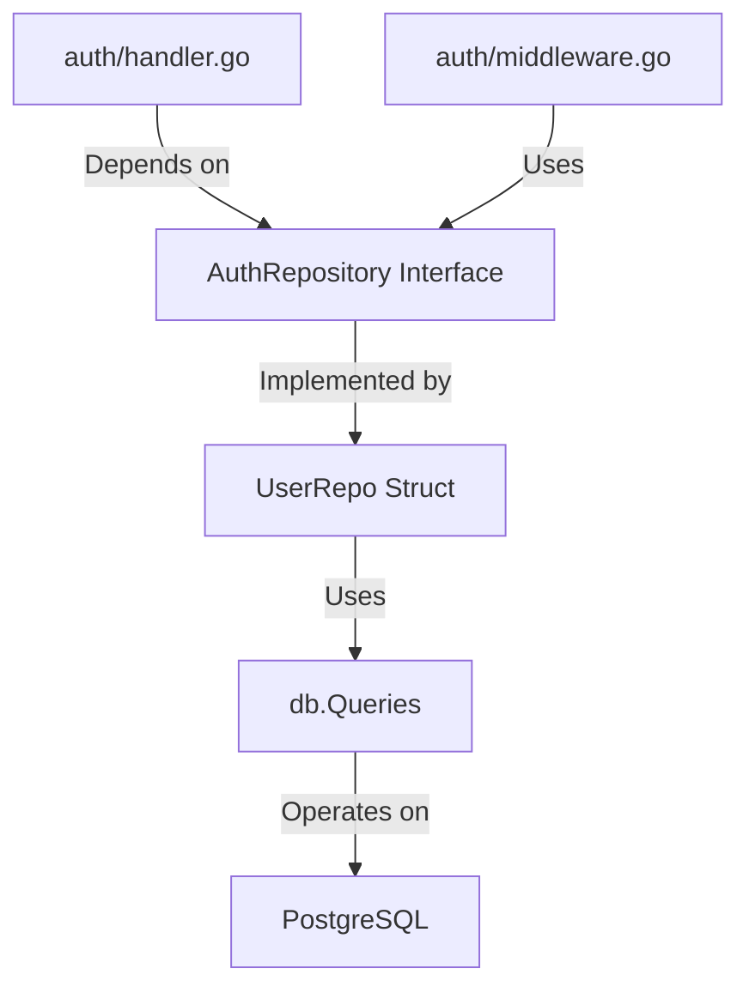

# Repository Pattern Implementation Analysis

## Overview
The repository pattern is used to abstract data access logic from business logic. In this implementation:



## Implementation Details

### 1. Interface Definition (`auth/repository.go`)
```go
type AuthRepository interface {
    CreateUser(user *sqlc.User) error
    GetUserByEmail(email string) (*sqlc.User, error)
    CreateSession(ctx context.Context, userID uuid.UUID, sessionToken string,
        csrfToken string, userAgent string, ip string, expiresAt time.Time) (sqlc.Session, error)
    GetSessionRowByToken(ctx context.Context, token string) (sqlc.Session, error)
    Authorize(r *http.Request) (uuid.UUID, error)
    // ... additional session management methods
}
```

### 2. Concrete Implementation (`auth/repository.go`)
```go
type UserRepo struct {
    queries *db.Queries
}

func (r *UserRepo) CreateUser(user *User) error {
    _, err := r.queries.CreateUser(context.Background(), db.CreateUserParams{
        Email:        user.Email,
        PasswordHash: user.PasswordHash,
    })
    return err
}
```

### 3. Dependency Injection (`auth/handler.go`)
```go
func InitAuthRepository(dbConn db.DBTX) {
    queries = db.New(dbConn)
    repo = NewUserRepository(queries)
}
```

## Benefits

### 1. Testability
Handlers can be tested with mock implementations:
```go
type MockUserRepo struct {
    CreateUserFunc func(user *User) error
    GetUserByEmailFunc func(email string) (*User, error)
}

func (m *MockUserRepo) CreateUser(user *User) error {
    return m.CreateUserFunc(user)
}
```

### 2. Database Abstraction
Allows switching databases without changing business logic:
```go
type MongoUserRepo struct {
    collection *mongo.Collection
}

func (m *MongoUserRepo) CreateUser(user *User) error {
    _, err := m.collection.InsertOne(context.Background(), user)
    return err
}
```

### 3. Centralized Data Access
Handles conversions between domain models and database entities:
```go
func (r *UserRepo) GetUserByEmail(email string) (*User, error) {
    dbUser, err := r.queries.GetUserByEmail(context.Background(), email)
    return &User{
        ID:           dbUser.ID,
        Email:        dbUser.Email,
        PasswordHash: dbUser.PasswordHash,
    }, nil
}
```

### 4. Error Handling Consistency
Database errors are handled in one place:
```go
func (r *UserRepo) CreateUser(user *User) error {
    _, err := r.queries.CreateUser(...)
    if pqErr, ok := err.(*pq.Error); ok {
        if pqErr.Code == "23505" {
            return ErrEmailExists
        }
    }
    return err
}
```

## When to Use This Pattern
This implementation is valuable for:
1. Applications requiring unit testing
2. Projects anticipating database migrations
3. Systems with complex data access logic
4. Teams following clean architecture principles
5. Long-term maintainability of large codebases

## Session Management
The repository now handles session operations:
```go
// Create a new session
session, err := repo.CreateSession(ctx, userID, sessionToken,
    csrfToken, userAgent, ip, expiresAt)

// Authorize a request
userID, err := repo.Authorize(request)

// Delete sessions by device
err := repo.DeleteSessionsByDevice(ctx, userID, userAgent, ip)
```

## Class Diagram
```mermaid
classDiagram
    class AuthRepository {
        <<interface>>
        +CreateUser(*sqlc.User) error
        +GetUserByEmail(string) (*sqlc.User, error)
        +CreateSession(...) (sqlc.Session, error)
        +Authorize(*http.Request) (uuid.UUID, error)
        +DeleteSessionsByDevice(...) error
    }

    class UserRepo {
        -queries *sqlc.Queries
        +CreateUser(*sqlc.User) error
        +GetUserByEmail(string) (*sqlc.User, error)
        +CreateSession(...) (sqlc.Session, error)
        +Authorize(*http.Request) (uuid.UUID, error)
    }

    class sqlc.Queries {
        +CreateUser(context, params) (sqlc.User, error)
        +CreateSession(context, params) (sqlc.Session, error)
        +GetSessionRowBySessionToken(context, token) (sqlc.Session, error)
    }

    UserRepo --|> AuthRepository : implements
    UserRepo --> sqlc.Queries : depends on
